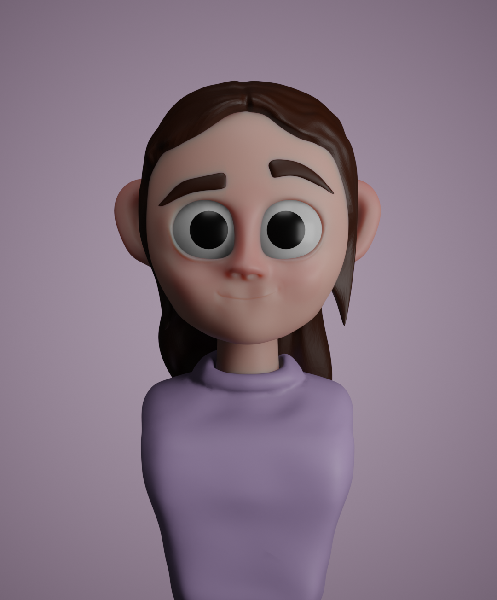

# Violet-Blender

Welcome to my "Violet-Blender" repository! This is where I'm sharing my first stylized character head sculpt, named Violet. While it's a basic sculpt with room for improvement, it's an important milestone in my journey to become a better 3D artist.

## About Violet

- **Sculpting**: I sculpted Violet using Blender, following a tutorial by Keelan Jon for stylized head sculpts on YouTube. However, I took creative liberties by transforming the character into a girl and giving her a unique hairstyle.

- **Materials and Rendering**: After sculpting, I added materials to color Violet, and then rendered her to bring out her character.

- **Retopology**: I initially attempted retopology to optimize the model's density, but it became a bit complex, so I decided to focus on improving my sculpting skills first.

## Rendered Artwork

Here's a short rendered animation showcasing her:

## Goals

- This project serves as a benchmark for my progress in character modeling.
- I'm excited to continue practicing and enhancing my skills to create even more captivating characters in the future.
- While Violet may have some issues, I'm proud of this first attempt and look forward to further growth as an artist.

Feel free to explore, provide feedback, or follow my artistic journey. I hope you find something inspiring or intriguing in my work.

Thank you for visiting my repository!
